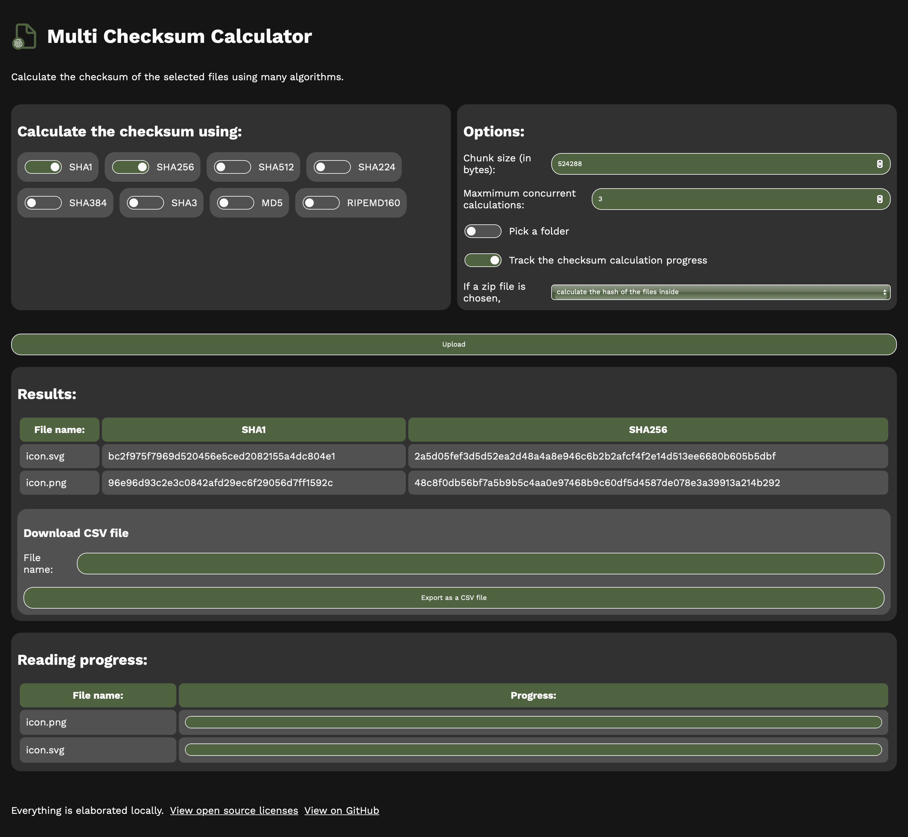

# multi-checksum-calculator
Calculate the checksum of your local files by using various hashing algorithms.

Try it: https://dinoosauro.github.io/multi-checksum-calculator/

## Usage

Open the webpage. You'll find at the left a list of hashing algorithms to choose from, and at the right you'll find some conversions options. Then, you'll be able to choose some files to calculate their hash. Everything happens inside your browser, so this might take a while. You're able to track the progress from the "Progress" table that'll appear at the bottom of the page, below the "Results" table where all of the selected hashes will be displayed. 

If you choose a zip file, you can choose in the settings:
- To calculate the hash of that single file;
- To calculate tha hash of the files inside the zip file;
- Or both.

You can also download the "Result" table as a CSV file, so that you can keep the calculated checksums.

